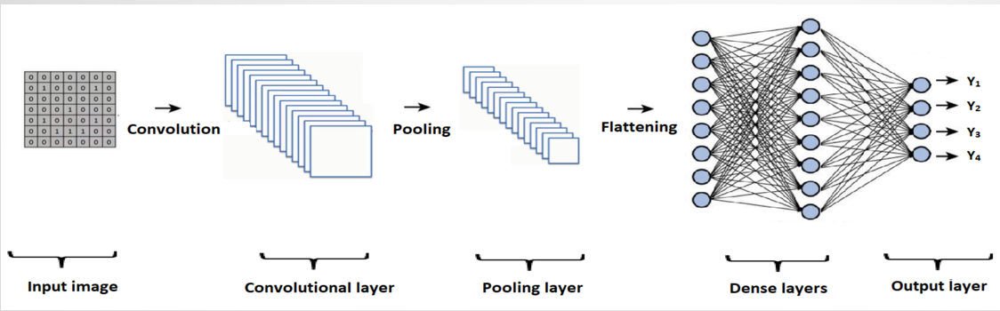

# INDIAN-CURRENCY-DETECTION-AND-COUNTING

Great technological advancement in printing and Scanning industry made counterfeiting problem to  grow more vigorously. As a result, counterfeit Currency affects the economy and reduces the value of Original money. Thus it is most needed to detect the Fake currency. Most of the former methods are based On hardware and image processing techniques. Finding counterfeit currencies with these methods is Less efficient and time consuming. To overcome the Above problem, we have proposed the detection of Counterfeit currency using a  Convolution neural Network and Recurrent neural network through teachable machine. Our work identifies the fake currency by Examining the currency images

## EXISTING SYSTEM
1 In this a methodology for counterfeit currency location extracts the general traits of latent pictures and distinguishing ID mark from the image of money.  Properties from images of currency notes can  includes the extraction of some noticeable and undetectable highlights of Indian currency. 
2 After demonetization 500 and 2000 are the high esteemed cash notes existing till date so there is a most extreme likelihood that this notes can be duplicated so as to maintain a strategic distance from this they use programming to identify the fake notes utilizing picture handling procedure.
### Disadvantages:
->Time taken process.
->Requires more memory Space.
->Required  hardware components.
->It requires 50 or 60 images to detect notes.

## PROPOSED SYSTEM
1 The proposed solution provides a fake currency detection system that understands the various features off currency like watermark,     shape, alignment, picture of Mahatma Gandhi, a translucent feel and a security thread.
2 The objective of system is to provide a better detection based on recorded information of currency. These systems use deep learning technique Convolution Neural Network (CNN) and Recurrent Neural Network(RNN) through teachable machine to process information and provide the user with potentially more relevant prediction.
### Advantages:
->Less time taken.
->Doesn’t require hardware machines.
->It requires 15 to 20 images to detect notes.

## Model  DESIGN
-> Series of layers to be implemented in the model are convolution, padding, pooling, flattening and full connection. In convolution operation there is a feature detector or filter. This filter detects edges or specific shapes. 
-> Filter is placed top left of image and multiplied with value on same indices. After that all results are summed and this result is written to output matrix. Then filter slips to right to do this whole process again and again. 
-> Usually filter slips one by one but it can be change according to your model and this slipping process.

## Architecture

</img>

## CNN ARCHITECHURE

</img>

## RNN ARCHITECHURE

</png>

## IMPLEMENTATION

</img>

## SEQUENCE DIAGRAM

## Features of real note

## Fake currency detection

## APPLICATIONS
->Currency Checking Machines
->Fake Currency Detection App.
->Counting Machine.

## SOFTWARE REQUIREMENTS
->Operating System : Windows / Linux / MacOS
->Python 3+ : Programming language
->Keras 2.0+ : Library for neural network which uses TensorFlow as its backend
->TensorFlow 2.0+ : Deep learning library in python.
->NumPy 1.18.2 : NumPy is the fundamental package for scientific computing with python.

## HARDWARE REQUIREMENTS
->Hardware Requirement
->Processor: i3 or i5
->RAM:  6GB 
->Storage: 500GB HDD
->Web camera
 
## CONCLUSION
    We proposed a Indian currency detection and counting  method that uses CNN,RNN through teachable machine  and  banknote images captured by a  camera under visible light conditions. Our method was designed to classify genuine and fake banknotes regardless of the denomination and the side of the banknote exposed to the camera. In addition, the use of a camera for capturing banknote images allows general users, including visually impaired people, to identify fake banknotes without using specialized devices.

